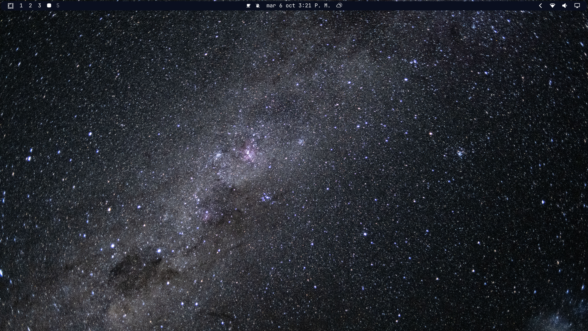

# Órbita

A dark space theme for Omarchy, with vivid blue panels, cyan accents and orbital
window borders. Includes an original ringed-planet wallpaper and 22 NASA space
wallpapers from the Artemis theme.



## Install

```bash
omarchy theme install https://github.com/CJ-Montero/omarchy-orbita-theme
```

## Default wallpaper

The original AI-generated ringed-planet wallpaper is
`backgrounds/00-orbita.png`. Its `00-` prefix puts it first in Omarchy's sorted
wallpaper list, so a fresh installation selects it by default. The other 22
wallpapers remain available in the wallpaper selector.

The desktop screenshot above uses the included NASA Starstruck wallpaper. It is
the preview supplied by the author; the default wallpaper is the ringed planet.

## Palette

| Role | Color |
| --- | --- |
| Deep space background | `#0e1420` |
| Cloud burst panels | `#243e63` |
| William selections and inactive borders | `#3f7895` |
| Bermuda cyan accents | `#68b3d8` |
| Tower foreground | `#c0dbe0` |

The palette is a more vivid variation of the original five blue-gray colors.
`colors.toml` lets Omarchy generate the terminal and editor themes; the
`shell.*.toml` files style the launcher, menus, popups and notifications.

## Optional workspace animation

Omarchy excludes Lua files when installing themes from GitHub. To enable the
matching orbital drift animation, add the following to your personal
`~/.config/hypr/looknfeel.lua`, after any existing workspace animation settings:

```lua
hl.curve("orbitaDrift", {
  type = "bezier",
  points = { { 0.45, 0.0 }, { 0.20, 1.0 } },
})

for _, leaf in ipairs({ "workspaces", "workspacesIn", "workspacesOut" }) do
  hl.animation({
    leaf = leaf,
    enabled = true,
    speed = 4.5,
    bezier = "orbitaDrift",
    style = "slidefade 28%",
  })
end
```

Reload with `hyprctl reload`, then check `hyprctl configerrors`. This gives a
450 ms horizontal slide and fade with smooth acceleration and deceleration.

## Credits and license

- Theme by [CJ Montero](https://github.com/CJ-Montero).
- Original ringed-planet wallpaper generated with OpenAI imagegen. The complete
  generation prompt is in `wallpaper-prompt.txt`.
- The 22 additional wallpapers are copied from
  [Artemis by Steve Lohmeyer](https://github.com/steve-lohmeyer/omarchy-artemis-theme),
  whose README credits NASA as their source. The original Artemis MIT notice is
  preserved in `LICENSE-Artemis`.
- This theme's configuration and original wallpaper are provided under the MIT
  license in `LICENSE`. Third-party material retains its original notices.
